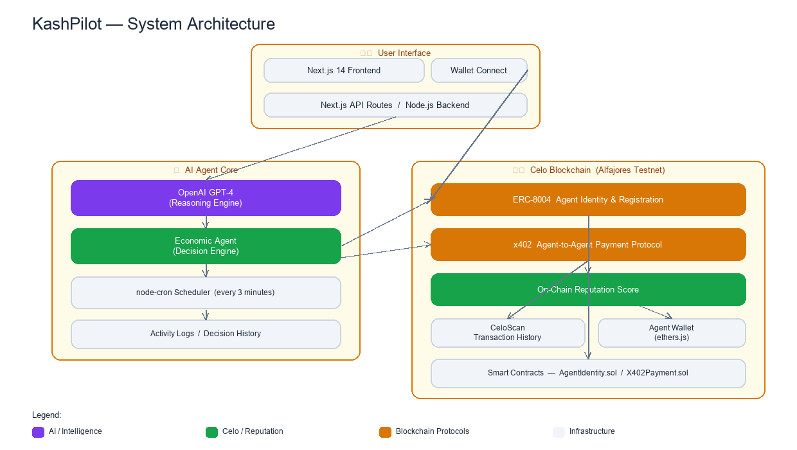
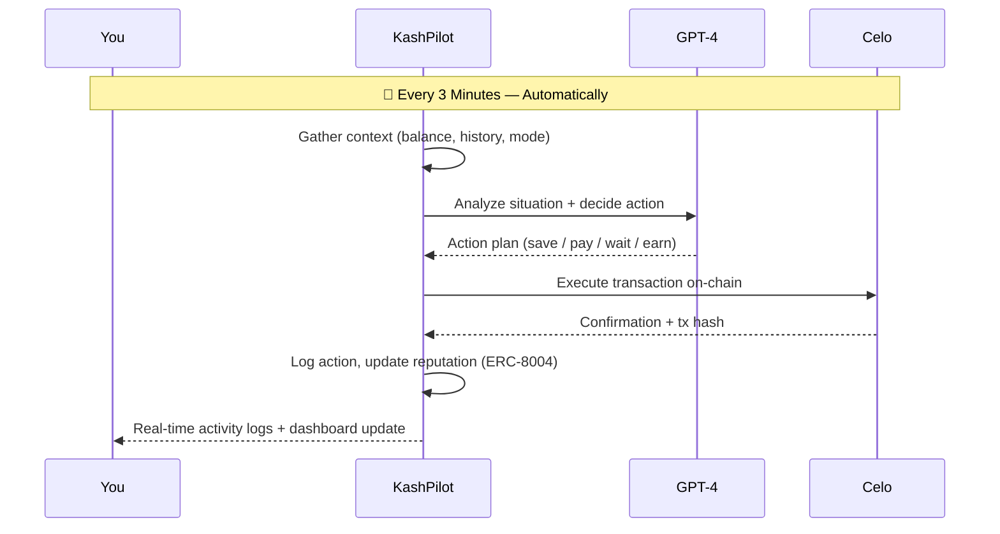
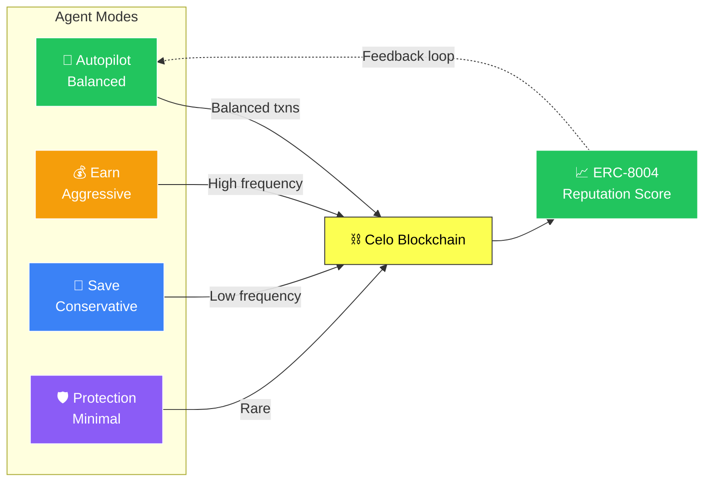
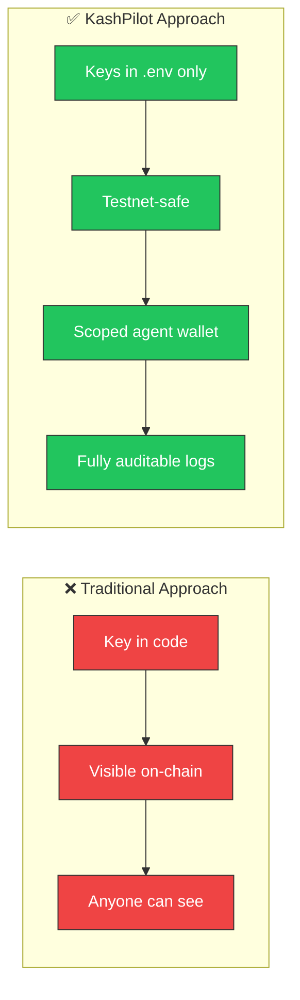

# 🤖💰 KashPilot

> **Your money. On autopilot.**

[](https://kash-pilot.vercel.app/)
[](https://celo.org)
[](https://nextjs.org)
[](https://openai.com)
[](./LICENSE)

---

## 📖 The Backstory

Most people believe managing crypto is something *you* have to do.

They are wrong.

There is a new kind of agent walking the blockchain — one that never sleeps, never panics, and never forgets to send that micro-payment. It doesn't care about market noise. It doesn't doomscroll price charts at 3 AM. It just **acts**.

```
While you sleep, KashPilot earns.
While you hesitate, KashPilot transacts.
While you forget, KashPilot remembers — and executes.
```

This is not a wallet. This is not a bot. This is an **autonomous economic agent** — powered by GPT-4, running on Celo, thinking in real-time, building reputation on-chain, and making decisions *for you*.

Meet **KashPilot**. Your money's new co-pilot. No input required.

---

## 🏗️ Architecture

### System Overview



### Autonomous Decision Flow



---

## 🤖 Agent Modes & Features

### The Four Modes of KashPilot

KashPilot doesn't just act randomly — it operates under a chosen strategic mode. Each mode shapes the agent's personality and decision logic:

#### 🛫 Autopilot Mode
*The balanced wanderer.*
- Maintains a healthy wallet balance
- Makes strategic micro-transactions
- Gradually builds on-chain reputation
- The default for most users

#### 💰 Earn Mode
*The aggressive accumulator.*
- Maximizes on-chain activity
- Frequent micro-payments to build reputation
- Rapid ERC-8004 score growth
- Best for reputation farming

#### 🏦 Save Mode
*The disciplined hoarder.*
- Minimizes outgoing transactions
- Only acts when confident in ROI
- Prioritizes balance preservation
- Best for conservative risk appetite

#### 🛡️ Protection Mode
*The fortress builder.*
- Near-zero transactions
- Capital preservation above all
- Only essential operations executed
- Maximum safety, minimum exposure



---

## 🔐 What Makes This Different?

Traditional crypto tools are reactive — they wait for *you* to do something.

KashPilot is **proactive**. It watches. It thinks. It acts.

| Feature | Traditional Wallets | KashPilot |
|--------|---------------------|-----------|
| Requires user action | ✅ Always | ❌ Never (unless you want) |
| AI-powered decisions | ❌ | ✅ GPT-4 |
| On-chain identity | ❌ | ✅ ERC-8004 |
| Agent-to-agent payments | ❌ | ✅ x402 Protocol |
| Reputation system | ❌ | ✅ On-chain score |
| Runs autonomously | ❌ | ✅ Every 3 minutes |
| Real-time thinking logs | ❌ | ✅ Live feed |

### Security Guarantees



---

## 🛠️ Technical Stack

### On-Chain (Celo)

```
contracts/
└── AgentIdentity.sol      # ERC-8004 agent registration & reputation
└── X402Payment.sol        # x402 agent-to-agent payment protocol

scripts/
├── generate-wallet.js     # Create agent wallet
├── register-agent.js      # Register on ERC-8004 contract
├── deploy-agent-identity.js
└── deploy-x402.js
```

### Off-Chain (Next.js + AI Agent)

```
app/
├── page.tsx               # Landing page
├── dashboard/page.tsx     # Real-time agent stats
├── agent/page.tsx         # Agent control panel
├── activity/page.tsx      # Transaction history
└── api/
    ├── dashboard/         # Stats endpoint
    ├── agent/
    │   ├── status/        # Agent health
    │   ├── toggle/        # Start / pause
    │   ├── mode/          # Switch modes
    │   ├── logs/          # Thinking logs
    │   └── command/       # Natural language input
    ├── wallet/            # Wallet connect
    └── transactions/      # History

lib/
├── blockchain/
│   ├── celo.ts            # Celo RPC integration
│   ├── erc8004.ts         # Agent identity helpers
│   └── x402.ts            # Payment protocol logic
├── ai/
│   └── agent.ts           # GPT-4 decision engine
└── agent/
    ├── economic-agent.ts  # Core agent class
    └── storage.ts         # JSON persistence layer
```

### Dependencies

```
next@14          # App framework
react@18         # UI library
tailwindcss      # Styling
ethers@6         # Celo blockchain interaction
openai           # GPT-4 integration
node-cron        # Autonomous scheduling
lucide-react     # Icon system
typescript       # Type safety
```

---

## 🚀 Getting Started

### Prerequisites

- Node.js 18+
- npm or yarn
- OpenAI API key → [platform.openai.com](https://platform.openai.com/api-keys)
- Celo Alfajores testnet CELO → [faucet.celo.org/alfajores](https://faucet.celo.org/alfajores)

### Installation

```bash
# Clone the repository
git clone https://github.com/Hijanhv/KashPilot.git
cd KashPilot

# Install dependencies
npm install
```

### Environment Setup

```bash
# Copy the example environment file
cp .env.example .env

# Run the interactive setup wizard
node scripts/setup-env.js
```

### Generate Agent Wallet

```bash
node scripts/generate-wallet.js
```

This outputs your agent's:
- 🏠 Wallet address
- 🔑 Private key
- 🌱 Mnemonic phrase

> **⚠️ IMPORTANT:** Save these credentials securely. Add them to `.env`:

```bash
AGENT_PRIVATE_KEY=your_private_key_here
AGENT_WALLET_ADDRESS=0xYourAgentAddress
```

### Fund Your Agent

Visit [faucet.celo.org/alfajores](https://faucet.celo.org/alfajores) and request testnet CELO for your agent wallet address.

### Add OpenAI Key

```bash
# In your .env file:
OPENAI_API_KEY=sk-your-openai-key-here
```

### (Optional) Deploy Smart Contracts

```bash
# Deploy ERC-8004 Agent Identity contract
node scripts/deploy-agent-identity.js

# Deploy x402 Payment contract
node scripts/deploy-x402.js

# Register your agent on-chain
node scripts/register-agent.js
```

Add contract addresses to `.env`:

```bash
NEXT_PUBLIC_AGENT_IDENTITY_CONTRACT=0x...
NEXT_PUBLIC_X402_PAYMENT_CONTRACT=0x...
AGENT_ID=kashpilot-1234567890
```

### Run KashPilot

**Terminal 1 — Launch the dashboard:**
```bash
npm run dev
```

**Terminal 2 — Start the autonomous agent:**
```bash
npm run agent
```

Open [http://localhost:3000](http://localhost:3000) and watch your agent come alive. 🚀

---

## 🌐 Environment Variables

```bash
# Celo Network
NEXT_PUBLIC_CELO_RPC_URL=https://alfajores-forno.celo-testnet.org

# OpenAI
OPENAI_API_KEY=sk-your-key-here

# Agent Wallet
AGENT_PRIVATE_KEY=your_private_key
AGENT_WALLET_ADDRESS=0xYourAddress

# Smart Contracts (Optional)
NEXT_PUBLIC_AGENT_IDENTITY_CONTRACT=0x...
NEXT_PUBLIC_X402_PAYMENT_CONTRACT=0x...

# Agent Identity (After registration)
AGENT_ID=kashpilot-1234567890
```

---

## 🗺️ Roadmap

### Phase 1: Foundation ✅
- ✅ Autonomous GPT-4 economic agent
- ✅ Celo Alfajores blockchain integration
- ✅ ERC-8004 agent identity & reputation
- ✅ x402 agent-to-agent payment protocol
- ✅ Agent modes: Autopilot, Earn, Save, Protection
- ✅ Real-time thinking logs
- ✅ Natural language command support
- ✅ Cron scheduler (every 3 minutes)
- ✅ Premium minimal UI (Apple/Stripe aesthetic)

### Phase 2: Intelligence 🚧
- ⬜ Multi-agent coordination & messaging
- ⬜ Advanced earning strategies (yield, LP)
- ⬜ WebSocket real-time dashboard updates
- ⬜ DeFi protocol integration (Ubeswap, Mento)
- ⬜ Agent memory & long-term learning

### Phase 3: Privacy 🔜
- ⬜ Confidential transaction amounts
- ⬜ Zero-knowledge balance proofs
- ⬜ Encrypted agent communication
- ⬜ Anonymous reputation system

### Phase 4: Scale 📈
- ⬜ Mainnet deployment
- ⬜ iOS & Android mobile app
- ⬜ Cross-chain support (Base, Arbitrum)
- ⬜ Agent marketplace
- ⬜ DAO governance for protocol parameters

---

## 🤝 Contributing

We welcome all contributors! Please see [CONTRIBUTING.md](./CONTRIBUTING.md) for full guidelines.

```bash
# Fork the repo

# Create your feature branch
git checkout -b feature/my-amazing-feature

# Commit your changes
git commit -m 'feat: add amazing feature'

# Push and open a PR
git push origin feature/my-amazing-feature
```

---

## 📜 License

This project is licensed under the **MIT License** — see the [LICENSE](./LICENSE) file for details.

---

## 🙏 Acknowledgments

- [Celo Foundation](https://celo.org) — Mobile-first blockchain infrastructure
- [OpenAI](https://openai.com) — GPT-4 reasoning engine
- [ERC-8004 Standard](https://github.com/ethereum/ERCs) — Agent identity on-chain
- [x402 Protocol](https://x402.org) — Agent-to-agent payment standard
- [Next.js Team](https://nextjs.org) — The framework powering the UI
- The builders, dreamers, and degens who believe autonomous agents are the future

---

<div align="center">

**KashPilot** — Your money. On autopilot.

*Built with ❤️ for the future of autonomous finance*

[🌐 Live Demo](https://kash-pilot.vercel.app/) • [📁 GitHub](https://github.com/Hijanhv/KashPilot) • [🐛 Issues](https://github.com/Hijanhv/KashPilot/issues)

</div>
